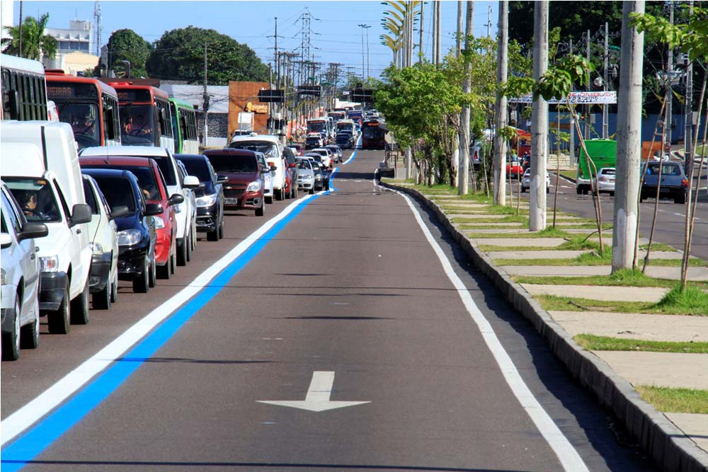

# Faixa Azul de Manaus

___
## Problema

Manaus é umas das cidade que enfreta  problemas com mobilidade urbana. Meios de transporte como **trem**, **metrô** , **monotrillho** e a falta de uma **ciclovia** ~~não estou falando de calçada~~ nunca foram implementadados na capital do amazonas. Sua população com cerca de [2.057.711 milhões de hábitantes](http://g1.globo.com/am/amazonas/noticia/2015/08/populacao-de-manaus-cresce-e-chega-2057711-estima-ibge.html). Detém do [6º maior PIB entre as cidades do Brasil](https://pt.wikipedia.org/wiki/Lista_de_munic%C3%ADpios_do_Brasil_por_PIB).

O manaura que precisa pegar um transporte coletivo em manaus passa cerca de 30 minutos esperando na parada, [enfreta condições precarias e ainda corre o risco de ser assaltado.](http://acritica.uol.com.br/manaus/manaus-amazonas-amazonia-Usuarios-sofrem-diariamente-transporte-coletivo-onibus-lotado-manaus_0_1076292362.html), sem levar em conta também das costantes [paralizações  que ocorrem e limitação de até 30% da frota do transporte coletivo](http://g1.globo.com/am/amazonas/noticia/2016/05/paralisacao-de-onibus-e-mantida-em-manaus-passageiros-reclamam.html)

___
## Solução
O que vem sendo solucionado para  minimizar esse problema de mobilidade urbana é a **BRT (Bus Rapid Trasit)** ~~Faixa azul~~ que é a inserção de ônibus articulados transitando pela faixa azul,sendo permitidos somente a pessagem por ônibus taxis e ambulâncias.

Porém  essa solução segue com uma série de contradições e incertezas , o próprio [Ministério Público já solicitou a suspensão  da faixa azul](http://g1.globo.com/am/amazonas/transito/noticia/2015/11/ministerio-publico-quer-suspensao-imediata-da-faixa-azul-em-manaus.html) e o prefeito de manaus Artur Neto vem suspendendo qualquer intervenção de suspenção desse sistema.

___
## Analise da solução

Criar uma votação por meio de um sistema web, para que as pessoas de manaus possam avaliar se estão a favor ou contra a faixa azul.

O resultado dessa votação estará aberto para a comunidade e principalmente será enviado para a Prefeitura de Manaus. Mostrando se a população está satisfeita ou não.

Cada pessoa, poderá votar somente uma vez. E será feito através do Facebook, utilizando sua estrutura da conta

___
